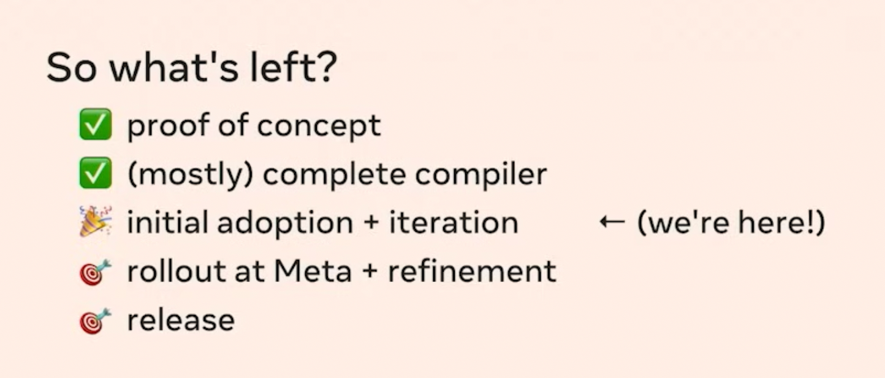

> 本文翻译自 [React Compiler & React 19 - forget about memoization soon?](https://www.developerway.com/posts/react-compiler-soon)

# React Compiler 和 React 19：你不再需要任何的 memo 了

实际上 React Compiler 并没有在 React 19 中发布，我们什么时候才能用它来移除 memo 呢？React Compiler 正式发布后，我们需要做什么来优化我们的应用呢？

过去一段时间内 React 社区一直在讨论 React Compiler（之前被称为 React Forget） 和 React 19 的发布，似乎很快我们将不再使用 useMemo 和 useCallback 等缓存 hooks。这篇文章将简单探索 React Compiler 即将给我们带来的变化。

## React 19 不等于 React Compiler

首先，React 19 不等于 React Compiler。React 团队在同一篇博客中宣布了 React 19 和 React Compiler 即将到来。似乎意味着很快我们将不再需要 memo 了。

但 React 团队成员的推文澄清了这一事实：


React 19 带来了很多新特性，但是不包含 React Compiler。React Compiler 何时发布？从另一个 React 团队的成员推文可以了解到在 2024 年底即将发布：


事实上，对这个时间点持怀疑态度的人很多。如果我们回顾 React Compiler 发布以及开发时间线：现在还处于 React Compiler 的中间阶段：



React Compiler 的开发始于 2021 年,到现在已经过去了两年。在像 Meta 这样庞大的代码库上推出如此基础性的改变是非常复杂的。从时间线的中间阶段到最终完成可能还需要另外两年时间。

不过谁知道呢,也许 React 团队真的能在今年发布它。如果真是这样，那确实是个好消息。根据官方视频介绍,React Compiler 最令人期待的承诺是:我们无需修改任何代码就能直接使用它 —— 它会"自动生效"(Just Work)。如果它真能在年底前发布,这将是一个很好的信号,表明这个承诺是可信的,而且我们所有人都能快速简单地切换到这个新工具上。

然而,即便 React Compiler 能在今年发布,而且确实如承诺的那样易于使用用且没有副作用,我们也不能立即就抛弃 `useCallback` 和 `memo`。这必然会经历一个过渡期 —— 从最初"可能你已经启用了 Compiler"的讨论，逐渐过渡到"你居然还没有迁移到 Compiler"这样的罕见情况。

可以回想一下,从类组件过渡到函数组件和 Hooks 的这个认知转变至少花了3年时间(从2018年开始) —— 这包括所有的课程、文档和博客的更新,大多数人迁移到支持 Hooks 的 React 版本,以及我们开始将函数组件和 Hooks 视为默认选择。即便到了今天,也就是6年之后,我们仍然能在很多项目看到类组件的身影。

如果我们把类似的时间线套用到 React Compiler 上,这意味着在未来至少三年内,我们仍然需要保持对 `memo`、`useMemo` 和 `useCallback` 的理解和运用。如果你有幸在一个现代的代码库工作,可以在 Compiler 发布后立即迁移,这个时间可能会缩短。但如果你是一名 React 讲师,或者在一个包含大量遗留代码、迁移速度较慢的大型代码库中工作,这个过渡期可能会更长。

## React Compiler 带来的变化

那么具体会有什么变化呢？简单来说 —— 所有内容都将被记忆化(memoized)。React Compiler 将作为一个 Babel 插件,它会把我们常规的 React 代码转换成一个全新的版本,在这个版本中,所有的 hook 依赖项、组件的 props 以及组件本身都会被自动记忆化。本质上来说,下面这样的代码：

```typescript
const Component = () => {
  const onSubmit = () => {};
  const onMount = () => {};

  useEffect(() => {
    onMount();
  }, [onMount]);

  return <Form onSubmit={onSubmit} />;
};
```

在底层会表现得就像 `onSubmit` 和 `onMount` 都被 `useCallback` 包裹,而 `Form` 组件被 `React.memo` 包裹一样：

```typescript
const FormMemo = React.memo(Form);

const Component = () => {
  const onSubmit = useCallback(() => {}, []);
  const onMount = useCallback(() => {}, []);

  useEffect(() => {
    onMount();
  }, [onMount]);

  return <FormMemo onSubmit={onSubmit} />;
};
```

当然,Compiler 并不会直接将代码转换成这种形式,它的实现要复杂和高级得多。但这个模型有助于我们理解它的工作原理。如果你对具体细节感兴趣,推荐观看 React 核心团队成员介绍 Compiler 的视频。如果你对为什么要在这里使用 useCallback 和 memo 还不太清楚,建议观看 YouTube 上 [Advanced React](https://www.youtube.com/watch?v=qOQClO3g8-Y) 系列的前六个视频,它们详细介绍了重渲染和记忆化的所有内容。如果你更喜欢阅读,也可以[查看这里的所有内容](https://www.developerway.com/tags/re-renders)。

这个转变对于 React 的教学和学习方式意味着以下几点：

### 父节点重新渲染时，子组件也会重新渲染

目前,当父组件重新渲染时,其内部渲染的所有子组件也会跟着重新渲染：

```typescript
// if Parent re-renders
const Parent = () => {
  // Child will also re-render
  return <Child />;
};
```

很多人现在认为只有当 Child 组件的 props 发生变化时才会重新渲染。我把这称为"[重渲染的巨大误区](https://www.developerway.com/posts/react-re-renders-guide#part2.5)"。实际上,在 React 的标准行为中,props 是否变化并不重要。

有趣的是,这个"误区"在 React Compiler 时代反而会成为现实。由于底层实现了全面的记忆化,当前的这个"误解"实际上会变成 React 的标准行为。几年后,我们就会这样教学生：React 组件只有在其 state 或 props 发生变化时才会重新渲染,父组件是否重新渲染并不重要。生活有时候就是这么奇妙。

### 不再需要为性能而进行组件拆分

目前,我们有一些组件拆分技巧,比如"[向下移动状态](https://www.developerway.com/posts/react-re-renders-guide#part3.2)"或"[将组件作为 children 传递](https://www.developerway.com/posts/react-re-renders-guide#part3.3)",这些都可以减少重渲染。我通常建议在使用 `useCallback` 和 `memo` 之前先尝试这些方法,因为[在 React 中正确地使用记忆化是非常困难的](https://youtu.be/huBxeruVnAM?si=xr2_IB8PErDgFYse)。

例如,在这段代码中：

```typescript
const Component = () => {
  const [isOpen, setIsOpen] = useState(false);

  return (
    <>
      <Button onClick={() => setIsOpen(true)}>
        open dialog
      </Button>
      {isOpen && <ModalDialog />}
      <VerySlowComponent />
    </>
  );
};
```

每次对话框打开时, `VerySlowComponent` 都会重新渲染,导致对话框打开时出现延迟。如果我们将打开对话框的状态封装在一个组件中,比如这样：

```typescript
const ButtonWithDialog = () => {
  const [isOpen, setIsOpen] = useState(false);

  return (
    <>
      <Button onClick={() => setIsOpen(true)}>
        open dialog
      </Button>
      {isOpen && <ModalDialog />}
    </>
  );
};

const Component = () => {
  return (
    <>
      <ButtonWithDialog />
      <VerySlowComponent />
    </>
  );
};
```

这样我们就在不使用任何 `memo`的情况下,避免了 `VerySlowComponent` 的不必要重渲染。

当 React Compiler 问世后,这些为性能而采用的模式就不再必要了。我们可能仍会出于组件组合和关注点分离的目的来使用这些模式,但不会再有重渲染的性能压力迫使我们将组件拆分得更小。我们的组件可能会变得更大,但这不会带来负面影响。

### 不再需要到处使用 `useMemo` / `useCallback`

显然,那些有时会困扰我们代码的 `useMemo` 和 `useCallback` 都将消失。这是最令我兴奋的部分。不再需要为了记忆化一个 `onSubmit` 回调���在多层组件中追踪 props。不再需要面对那些相互依赖、难以理解、难以调试的 `useMemo` 和 `useCallback` 链。不再因为有人忽略了子组件的记忆化而导致整个记忆化链条失效。

### Diffing 和 协调过程的变化

我们可能需要改变对 React 中 [diffing 和协调过程](https://www.developerway.com/posts/reconciliation-in-react)的解释方式。目前的简化解释是：当我们像这样"渲染"一个组件 `<Child />` 时,我们只是创建了它的一个 Element。这个 element 是一个这样形状的对象：

```typescript
{
  "type": ...,
  "props": ...,
  // other react stuff
}
```

其中 "type" 可以是字符串或者组件的引用。

在这段代码中：

```typescript
const Parent = () => {
  return <Child />;
};
```

当 `Parent` 重新渲染时,它的函数会被触发,并且 `<Child />` 对象会被重新创建。React 会对重渲染前后的对象进行浅比较,如果对象的引用发生了变化,这就表明 React 需要对该子树进行完整的 diffing。

目前,这就是为什么 `<Child />` 组件总是会重新渲染的原因,即使它没有任何 props。`<Child />` (这是 `React.createElement` 函数调用的语法糖)的结果是一个总是会被重新创建的对象,这意味着它无法通过浅比较检查。

在 React Compiler 中,Elements、diffing 和协调的概念保持不变,这是好消息。但看起来现在 `<Child />` 如果它的 props 没有改变,将会返回一个记忆化的对象。所以实际上,Compiler 的最终结果更像是把所有东西都包装在 `useMemo` 中,甚至包括 Elements:

```typescript
const Parent = () => {
  const child = useMemo(() => <Child />, []);
  return child;
};
```
不过这只是我根据有限的公开资料做出的推测,可能会有一些偏差。无论如何,这些都只是实现细节,对我们的生产代码来说并不重要。

---

其他方面基本保持不变。在组件内部创建组件仍然是一个[重大的反模式](https://www.developerway.com/posts/reconciliation-in-react#part10)。我们仍然需要使用 "key" 属性来标识元素或重置状态。`Context` 的使用依然会很棘手。而关于数据获取和错误处理的一切都不在这次讨论的范围内。

不过无论如何,我都迫不及待地想看到 Compiler 的发布。这似乎会让我们的 React 开发生活有一个巨大的改善。即使这意味着我要重写一半的文章和重做一半的 YouTube 视频 😅。
